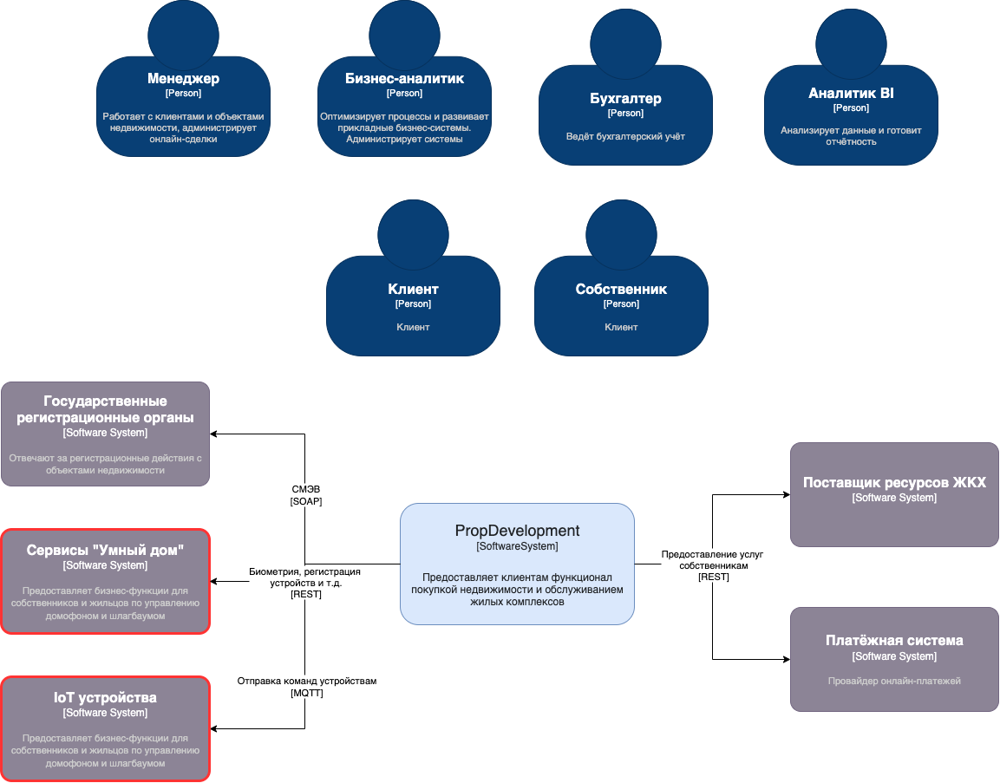
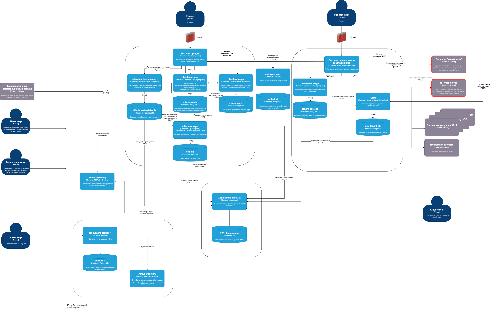

# 1. Требования к внешним интеграциям

## 1.1. Требования к безопасности

### Защита персональных данных
*(включая биометрию и номера автомобилей)*:
- Соответствие 152-ФЗ (РФ) и GDPR (если есть иностранные клиенты)
- Шифрование данных:
  - При передаче: TLS 1.2+
  - При хранении: AES-256
- Анонимизация/псевдонимизация данных, где возможно

### Контроль доступа:
- **Принцип минимальных привилегий**: доступ только к необходимым API-методам
- **Многофакторная аутентификация (MFA)** для администраторов

### Защита API:
- OAuth 2.0 с JWT-токенами для аутентификации
- Rate limiting для предотвращения DDoS
- Валидация входных данных (SQL-инъекции, XSS)

### Мониторинг и журналирование:
- Логирование всех запросов к API (кто, когда, какие данные запрашивал)
- SIEM-интеграция для обнаружения аномалий

### Физическая безопасность партнёра:
- Сертификация ISO 27001 у поставщика услуг
- Аудит безопасности инфраструктуры партнёра

## 1.2. Протоколы аутентификации и авторизации

| Компонент                      | Протокол/Механизм          | Описание                                   |
|--------------------------------|---------------------------|-------------------------------------------|
| Аутентификация пользователей   | OAuth 2.0 + OpenID Connect (PKCE flow - для мобильных пользователей и Client Credentials Flow для machine-to-machine) | Интеграция с текущим IdP PropDevelopment  |
| Авторизация API                | JWT-токены (с коротким TTL) | Проверка ролей (tenant, admin, service)  |
| Управление устройствами        | MQTT over TLS             | Для IoT-устройств (домофон, шлагбаум)    |

# Диаграммы

Ссылка на диаграммы - https://drive.google.com/file/d/1G0gkO4_U1M7VLuhR3WpJlAxFzcRL7flb/view?usp=sharing

## 1. Контекстная диаграмма

## 2. Обновлённая контейнерная диаграмма

